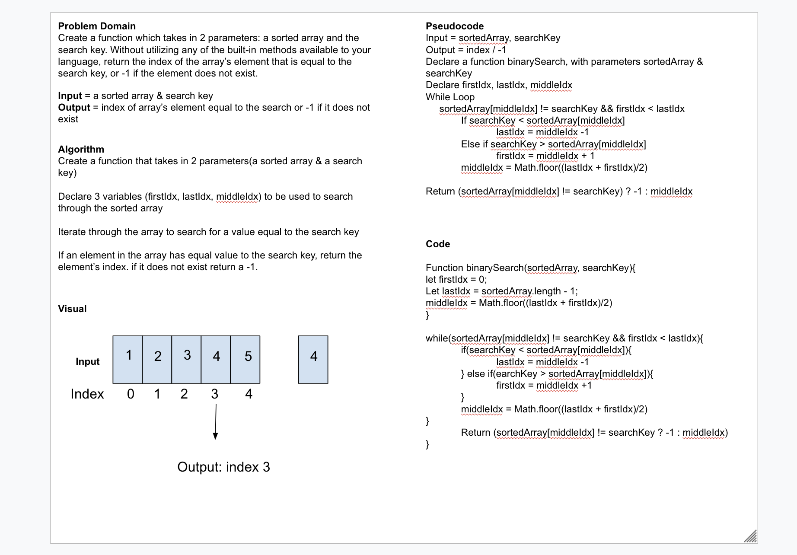

# Binary Search

<!-- Short summary or background information -->

## Challenge
<!-- Description of the challenge -->

Create a function which takes in 2 parameters: a sorted array and the search key. Without utilizing any of the built-in methods available to your language, return the index of the array’s element that is equal to the search key, or -1 if the element does not exist.

## Approach & Efficiency
<!-- What approach did you take? Why? What is the Big O space/time for this approach? -->

Resource/s: (https://www.w3resource.com/javascript-exercises/javascript-array-exercise-18.php)

Created a function that takes 2 parameters (a sorted array and a search key). Using While loop and If-else conditionals to iterate on the array to search for the array element equal to the search key, then return the index of that array element. If array element equal to search key does not exist, return -1.

## Solution
<!-- Embedded whiteboard image -->

